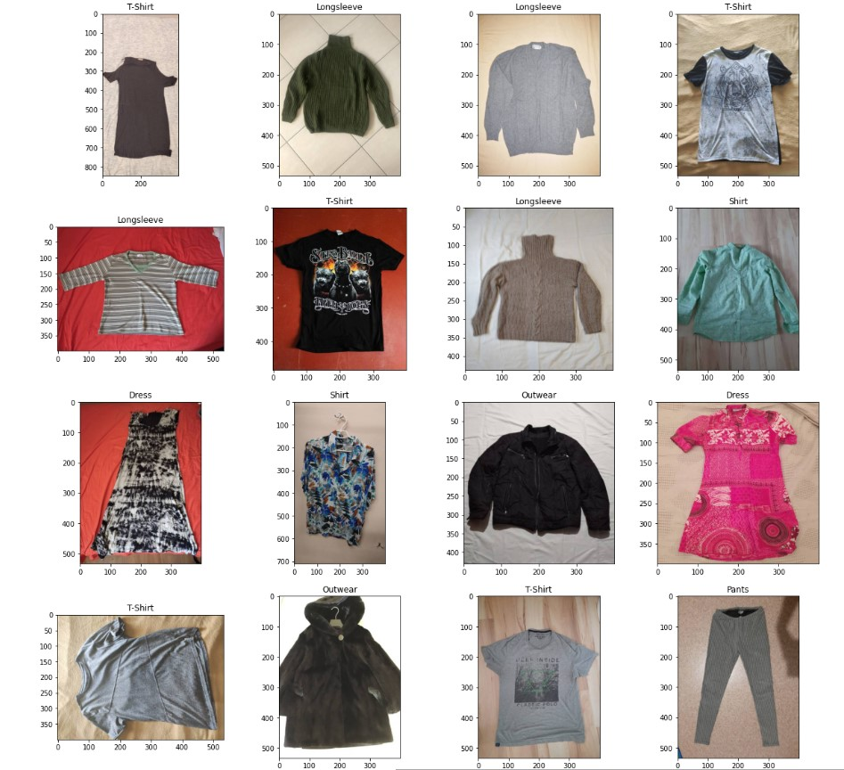
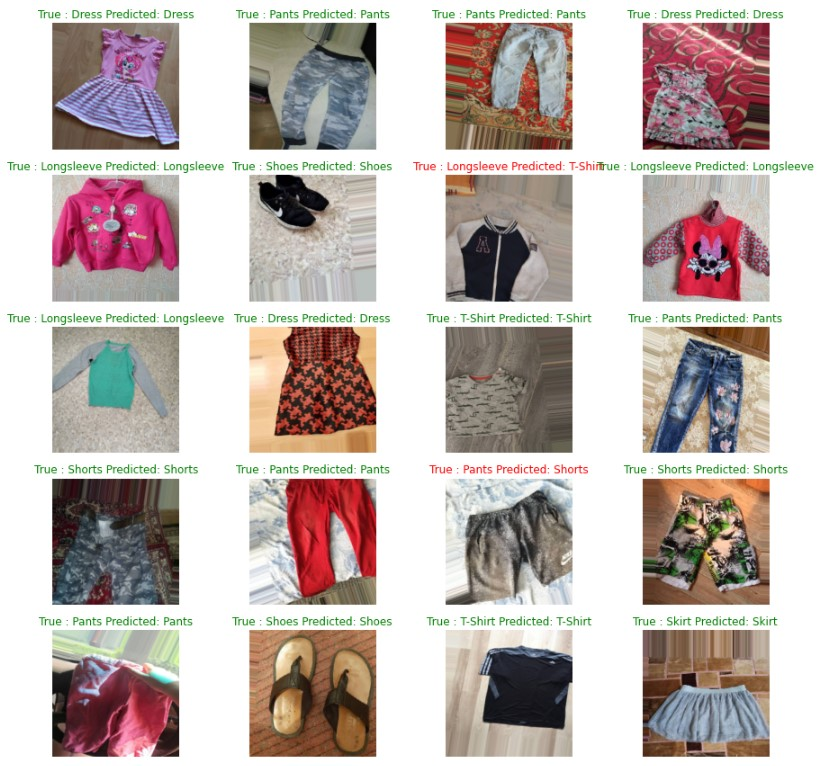
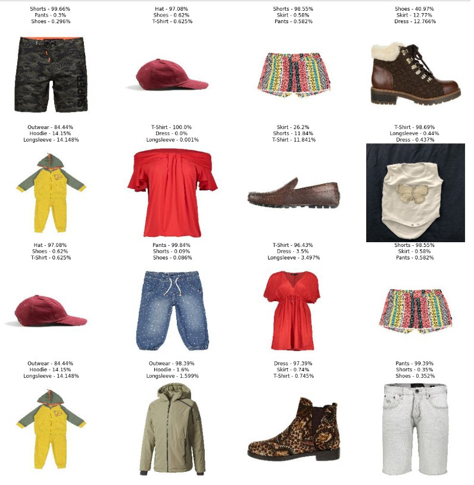

# Garment Classification

Dataset - https://www.kaggle.com/datasets/agrigorev/clothing-dataset-full

## Clothing dataset

Over 5,000 images of 20 different classes.
 
This dataset can be freely used for any purpose, including commercial:
 
For example:

- Creating a tutorial or a course (free or paid)
- Writing a book
- Kaggle competitions (as an external dataset)
- Training an internal model at any company

 Here are some images from the training set

 

  

 I used 11 classes from the dataset,  I have used MobileNetv2 model and transfer learning to train on the data set and achieved a validation accuracy of 80% 

 

Here are some of the model's predictions on the validatation data

 

  

 

Here are some the model's prediction for unseen data

 

  

